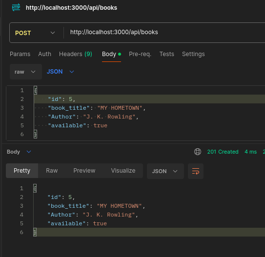

# Book Management API

A simple Node.js API for managing books.

## Features
- Retrieve a list of all books
- Retrieve a specific book by its ID
- Create a new book
- Update an existing book
- Partial update of an existing book
- Delete a book

## API Endpoints

- `GET /api/books`: Retrieve a list of all books
- `GET /api/books/:id:` Retrieve a specific book by its ID
- `POST /api/books`: Create a new book
- `PUT /api/books/:id`: Update an existing book by its ID
- `PATCH /api/books/:id`: Partial update of an existing book by its ID
- `DELETE /api/books/:id`: Delete a book by its ID

## Screenshots

Screenshots of the API in action are provided below:

1. **GET Request for All Books**:

2. **GET Request for a Single Book**:

3. **POST Request to Add a New Book**:

4. **PUT Request to Update a Book**:

5. **PATCH Request to Partially Update a Book**:

6. **DELETE Request**:

## Updates and Features

### Persistent Data Management

- **Globally Accessible Data**: The `books` variable is globally accessible throughout the server's request-handling logic, enabling consistent data operations.

- **Automated Data Saving**: The `saveBooks` function has been implemented to automatically update the `books.json` file whenever changes to the books data are made through POST, PUT, PATCH, or DELETE requests.

- **Reliable Updates**: Changes made via the API are immediately saved to the file, ensuring that the server always provides the latest information.

### Enhanced Server Reliability

The server includes improved error handling to ensure stability and accurate responses during file operations and client interactions.

## Technologies Used

- Node.js
- HTTP module
- fs module

## License

This project is licensed under the MIT License - see the LICENSE file for details.

